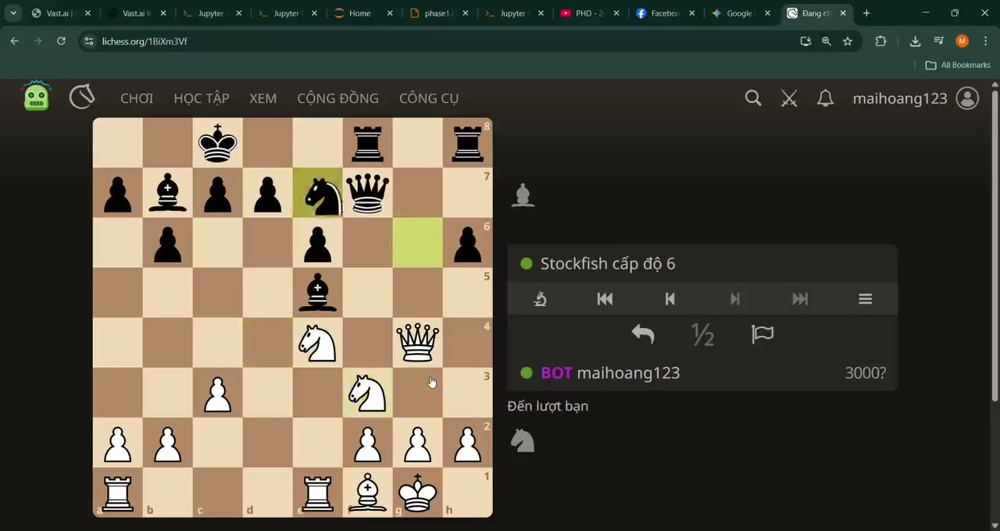
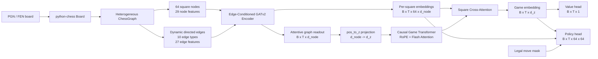
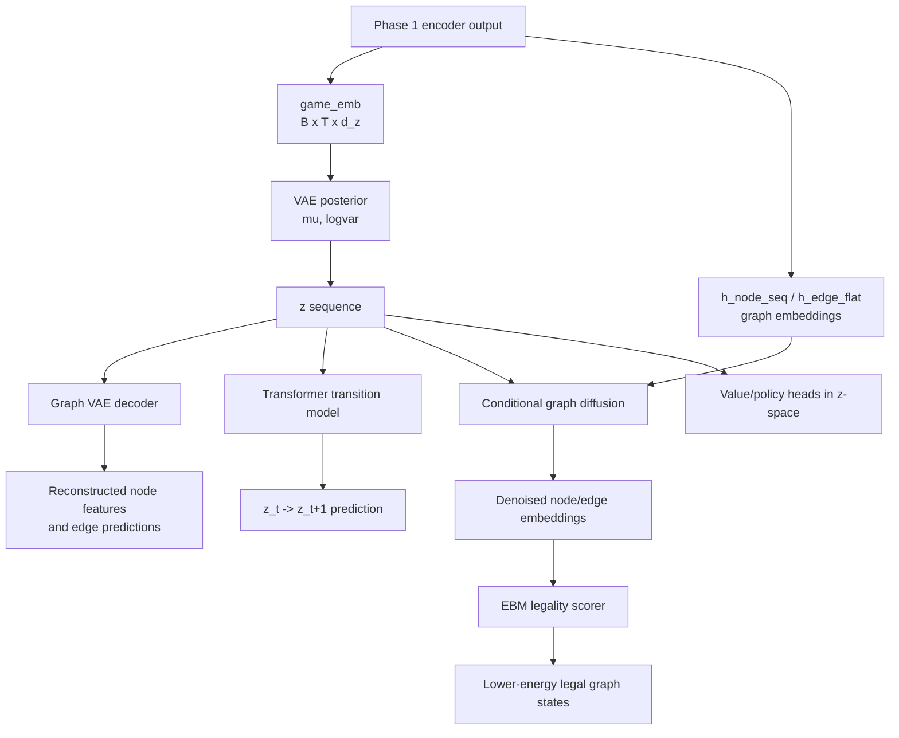
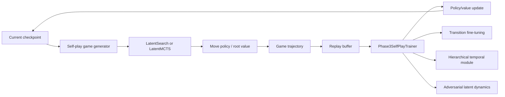

# ChessGNN

ChessGNN is a research-style neural chess engine built around a heterogeneous
graph representation of the chess board. The project explores a three-phase
training pipeline:

1. Supervised policy/value learning from games.
2. A latent world model with VAE, transition dynamics, diffusion refinement, and
   EBM-based legality scoring.
3. Self-play reinforcement learning with replay, latent search, and optional
   MCTS-style planning.

The goal is not to wrap Stockfish or hand-code chess heuristics. The goal is to
learn chess decisions from structured board relations: pieces, squares, legal
moves, attacks, defenses, pins, king zones, pawn structure, and game history.

## Demo

[](docs/demo/lichess_chessgnn_demo.mp4)

The demo video shows ChessGNN running as a live Lichess bot through the
`cal_elo/lichess-bot` adapter. The bot loads a PyTorch checkpoint, converts the
current Lichess board to a graph with `python-chess`, masks illegal moves, and
selects a move from the model policy head. The adapter also contains an optional
`LatentMCTS` mode for search-based play.

Demo integration files:

- `cal_elo/lichess-bot/homemade.py` - ChessGNN engine wrapper for lichess-bot.
- `cal_elo/lichess-bot/auto_ai_loop.py` - automated Lichess AI game loop.
- `cal_elo/evaluate_lichess_logs.py` - parser for bot logs and score summaries.

Current qualitative result: the Phase 1 policy/value checkpoint can play legal
and coherent games online without hand-written chess search, with stronger play
in opening/middlegame positions than in endgames. Formal Elo is not claimed yet;
the `cal_elo` tools are included to make future comparisons reproducible and
balanced by color and Lichess AI level.

## Motivation / Problem

Most neural chess projects start with an 8x8 tensor and use a CNN. That is a
reasonable baseline, but chess is not just image-like local texture:

| Chess property | CNN board tensor | ChessGNN graph |
| --- | --- | --- |
| Long-range sliding attacks | Must be learned indirectly through many layers | Direct ATTACK, CONTROL, XRAY, and PIN edges |
| Legal move structure | Usually added as a mask after prediction | Legal moves are first-class graph edges |
| Piece interactions | Encoded as channels on squares | Explicit source/destination edge relations |
| Non-local tactics | Hard for small kernels | Message passing follows tactical relations |
| Chess-specific rules | Need extra channels or post-processing | Castling, en passant, king zone, pawn structure edges |
| Game history | Not captured by a single board image | Causal Transformer over position sequence |

The core idea is to represent a chess position as a heterogeneous directed graph:

- 64 fixed nodes, one per square.
- 29 node features per square.
- Dynamic directed edges for legal moves, attacks, defenses, pins, x-rays, king
  zones, pawn structure, castling, en passant, and control.
- 27 edge features per relation.
- 10 semantic edge types.

This lets the model perform message passing over the same relations a chess
player reasons about, instead of forcing everything through local image filters.

## Architecture Overview

### Phase 1 - Supervised Policy/Value Model

Phase 1 trains the playable chess agent. It predicts:

- `value`: scalar game outcome estimate for each position.
- `policy`: 64 x 64 from-square/to-square move logits.



Important implementation choices:

- `board_to_graph()` builds a typed graph from `python-chess`.
- `ChessGNNEncoder` projects raw node/edge features into learned embeddings.
- `EdgeCondGATv2Layer` injects edge embeddings directly into attention scores.
- `GameLevelEncoder` batches all `B*T` positions into one disconnected graph
  batch, avoiding a Python loop over timesteps.
- `GameTransformer` models history with causal self-attention and RoPE.
- `SquareCrossAttention` brings square-level spatial features back into the
  temporal game embedding before the heads.
- `PolicyHead` scores every from-square/to-square pair and applies a legal move
  mask before inference.

Default dimensions in the current model:

| Component | Value |
| --- | --- |
| Raw node feature dim | 29 |
| Raw edge feature dim | 27 |
| Node embedding dim `d_node` | 128 |
| Edge embedding dim `d_edge` | 64 |
| Latent/game dim `d_z` | 256 |
| GNN layers | 6 |
| Transformer layers | 6 |
| Policy space | 4096 from-to logits |

### Phase 2 - Latent World Model

Phase 2 extends the supervised model into a world model. The purpose is to learn
a latent state space where the engine can reconstruct positions, predict future
states, refine graph embeddings, and score legality.



Phase 2 is intentionally split into smaller stages to reduce gradient conflicts
and memory pressure:

| Stage | Goal | Main modules |
| --- | --- | --- |
| 2A | Build stable latent space | VAE posterior, graph decoder, z value/policy heads |
| 2B | Learn dynamics | Transformer transition model |
| 2C | Sharpen graph embeddings | Conditional diffusion denoiser |
| 2D | Joint refinement | Diffusion + EBM legality scoring |

Training safeguards in the codebase include:

- KL warmup and free-bits to reduce posterior collapse.
- Component-level loss weights for reconstruction, transition, diffusion, EBM,
  value, policy, and anchor losses.
- Optional loss normalization by moving average.
- Separate optimizers for VAE, transition, diffusion, EBM, and encoder groups.
- Encoder freeze/unfreeze controls for Phase 2.
- FP32 branch support for diffusion/EBM when AMP instability is a risk.
- Split-stage checkpoints and quality-gate metrics.

Phase 2 is active research work in this repository. The implementation is meant
to expose the full modeling stack and training infrastructure, not to claim a
finished world-model chess engine yet.

### Phase 3 - Self-Play RL and Search

Phase 3 is the reinforcement learning layer. It uses the supervised model and
latent world model as a foundation, then improves policy/value estimates through
self-play trajectories.



Key components:

- `ReplayBuffer` stores positions, policies, values, and trajectories.
- `LatentSearch` evaluates candidate moves in latent space.
- `LatentMCTS` supports AlphaZero-style visit-count search.
- `ParallelSelfPlayManager` runs multi-process self-play workers with a batched
  GPU inference server.
- `HierarchicalGameTransformer` models multiple temporal resolutions.
- `AdversarialDynamics` explores white/black latent policies and Nash-style
  objectives.

Phase 3 is experimental. The project already contains the training and search
infrastructure, but the strongest stable public-facing story is still the Phase
1 supervised GNN + Transformer agent plus the Phase 2 world-model extension.

## Data Flow

For supervised training, a PGN game becomes a sequence of graph positions:

```text
PGN game
  -> FullGameDataset
  -> [B, T] graph sequence with padding mask
  -> batched disconnected ChessGraph for all B*T positions
  -> GNN node/edge embeddings
  -> causal temporal Transformer
  -> value and legal-masked policy heads
```

The policy target is indexed as:

```python
policy_index = move.from_square * 64 + move.to_square
```

The model outputs a dense 4096-way policy, then masks it with the legal move
matrix from `python-chess`.

## Repository Map

| Path | Purpose |
| --- | --- |
| `chessgnn/graph_representation.py` | Board-to-graph conversion and chess feature engineering |
| `chessgnn/gnn_encoder.py` | Edge-conditioned GATv2 encoder |
| `chessgnn/spatio_temporal.py` | Batched full-game GNN encoder |
| `chessgnn/game_transformer.py` | RoPE causal Transformer and square cross-attention |
| `chessgnn/world_model_vae.py` | VAE posterior, graph decoder, transition model, heads |
| `chessgnn/diffusion_decoder.py` | Conditional graph diffusion denoiser |
| `chessgnn/ebm_correction.py` | Energy model, legality pipeline, Langevin correction |
| `chessgnn/adversarial_latent.py` | Latent-space adversarial RL components |
| `chessgnn/hierarchical_temporal.py` | Multi-scale temporal modeling |
| `chessgnn/model.py` | Unified `ChessGNNModel` wrapper |
| `chessgnn/training.py` | Phase 1/2/3 trainers and training config |
| `chessgnn/data_pipeline.py` | PGN/FEN datasets, move indexing, graph collation |
| `chessgnn/self_play.py` | Replay buffer, latent search, MCTS |
| `chessgnn/parallel_self_play.py` | Multi-process self-play and batched inference |
| `cal_elo/` | Lichess bot demo and evaluation tooling |
| `edge_AI/` | ONNX / edge deployment experiments |
| `tests/` | Unit and integration tests |

## Quick Start

Install the core dependencies:

```bash
pip install torch torch_geometric python-chess numpy
```

Optional but useful:

```bash
pip install tqdm psutil stockfish
```

Run tests:

```bash
pytest tests/ -v
```

Run the web demo:

```bash
python web_demo.py --checkpoint checkpoints/v2_phase2_best.pt --port 8000
```

Train Phase 1 locally:

```bash
python run_phase0_local.py --data-dir <path-to-pgn-data> --n-workers 64 --depth 10
```

Run Phase 2 world-model training:

```bash
python run_phase2_vastai.py
```

Run Phase 3 self-play training:

```bash
python run_phase3_vastai.py
```

## Lichess Bot Demo

The Lichess demo uses the upstream `lichess-bot` project as a bridge and
implements ChessGNN as a homemade engine.

Typical local flow:

```bash
cd cal_elo/lichess-bot
python lichess-bot.py
```

In another terminal, start automated games against Lichess AI:

```bash
python cal_elo/lichess-bot/auto_ai_loop.py --level 5 --level 6 --color alternate
```

Important notes:

- The Lichess OAuth token must stay private and should never be committed.
- Checkpoints are large and should usually be shared through releases, cloud
  storage, or Git LFS instead of normal git history.
- The included demo video is a compressed portfolio artifact, not a benchmark.

## Evaluation

The `cal_elo` folder contains scripts for collecting and analyzing games from
Lichess bot logs:

```bash
python cal_elo/evaluate_lichess_logs.py summary \
  cal_elo/lichess-bot/lichess_bot_auto_logs/lichess-bot.log \
  --label phase1_window
```

For fair checkpoint comparison, use fixed buckets by level and color:

```bash
python cal_elo/run_fixed_benchmark.py \
  --baseline-key phase1_interrupted \
  --candidate-key phase2_ep001 \
  --label-baseline phase1 \
  --label-candidate phase2
```

Recommended protocol before making rating claims:

- At least 40 games per checkpoint.
- Balanced white/black games.
- Fixed Lichess AI level distribution.
- Report raw score and balanced score by bucket.
- Keep endgame failures separate from opening/middlegame move quality.

## Training Configuration

Central configuration lives in `TrainConfig`:

```python
from chessgnn.training import TrainConfig

config = TrainConfig.kaggle_t4()
```

The config includes:

- Phase-specific learning rates.
- Batch sizes and gradient clipping.
- AMP and gradient accumulation.
- KL warmup and free-bits.
- Phase 2 split-stage gates.
- Replay buffer size and self-play settings.
- Parallel self-play worker count.

The model is designed to run on CUDA when available:

```python
device = torch.device(config.device)
```

## Checkpoint Format

Checkpoints follow this structure:

```python
{
    "model_state_dict": {...},
    "optimizer_state_dict": {...},
    "scheduler_state_dict": {...},
    "scaler_state_dict": {...},
    "epoch": int,
    "phase": str,
    "metrics": {...},
    "config": TrainConfig(...),
}
```

## Current Status and Limitations

What is solid:

- Heterogeneous graph representation for chess positions.
- Edge-conditioned GATv2 encoder.
- Full-game batched supervised policy/value training.
- Causal Transformer over game history.
- Legal-move masking and Lichess bot integration.
- Training infrastructure for multi-component world-model experiments.

What is still in progress:

- Stable Phase 2 world-model training across all components.
- Statistically meaningful Elo evaluation.
- Endgame strength.
- Fully validated Phase 3 self-play RL.
- Production-ready model packaging.

Known modeling risks:

- Phase 2 has multiple objectives with different loss scales.
- VAE KL can dominate if warmup/free-bits are poorly tuned.
- EBM negatives can become too easy if corruption is unrealistic.
- Self-play search must match the same encoder path used during training.

## Resume Summary

This project demonstrates:

- Deep learning model design in PyTorch and PyTorch Geometric style.
- Graph neural networks for structured relational reasoning.
- Transformer-based sequence modeling with causal attention and RoPE.
- VAE, diffusion, and energy-based modeling for world-model research.
- Reinforcement learning infrastructure with replay buffers and MCTS-style
  search.
- Practical deployment through a live Lichess bot and web demo.

Short CV version:

> Built a supervised GNN + Transformer chess policy/value model over
> heterogeneous board graphs. Designed an Edge-Conditioned GATv2 encoder with a
> causal RoPE Transformer and square-level cross-attention. Extended the system
> toward a latent world model with VAE, transition Transformer, diffusion graph
> refinement, EBM legality scoring, and self-play search infrastructure.

